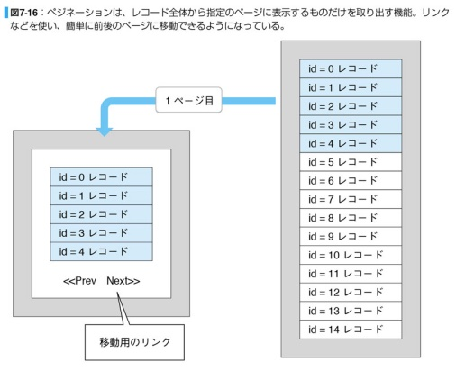

## Laravelのフォルダ構成

| フォルダ名 | 役割                                                                         |
| ---------- | ---------------------------------------------------------------------------- |
| app        | アプリケーションのプログラム部分がまとめられている                           |
| bootstrap  | アプリケーション実行時に最初に行われる処理がまとめられている                 |
| config     | 設定関係ファイルがまとめられている                                           |
| database   | データベース関連のファイルがまとめられている                                 |
| public     | 公開フォルダ。 外部にそのまま公開されるファイルがまとめられている            |
| resources  | プログラムのテンプレートファイルなどがある                                   |
| routes     | ルート情報の保存場所。アクセスするアドレスと実行するプログラムをバインドする |
| strage     | ログファイルなどのファイルの保存場所。                                       |
| tests      | ユニットテスト関係のファイルが用意されている                                 |
| vendor     | フレームワーク本体のプログラムがまとめられている                             |

## [csrf(cross-site request forgeries)](https://siteguard.jp-secure.com/blog/what-is-csrf)

- ```<form></form>```タグ内に記述する
- Webアプリケーションの脆弱性をついた攻撃手法
- Laravelではcrsf対策の機能を持っている
- スクリプトなどを使い外部からフォームを送信する攻撃。フォームに大量のコンテンツを送りつけたりするなどが行われる。
- 攻撃用のWebページを用意して、システムに意図しないリクエスト(ログインしていた場合、ユーザー情報を取得するなど)を行うことを強要
  - 記載方法
    1. @crsf：Laravel5.6以降の記載方法。こちらを使用する！！
    2. {{csrf_field()}：Laravel5.5までの記載方法
- Laravelではアプリケーションで、ユーザーごとのトークンを自動生成する。  
  そして、認証済みユーザーが実際にアプリケーションへリクエストを行なっているユーザーであることを確認する。  
  トークンはユーザーのセッションに保存され、セッションが再生成されるたびに変更される。  
  [参考サイト](https://readouble.com/laravel/8.x/ja/csrf.html)

## artisan

- Laravelで使用されるCLIの1つ
- LaravelでWebサービスを作る際の設定やコードを簡単なコマンドで実装できる
- 構文
  ```
  php artisan コマンド
  ```
- 例：Controllerを作成(app/Http/Controllerに作成される)
  ```
  php artisan make:controller HelloController
  ```
- [その他コマンド](https://qiita.com/zaburo/items/37768b743ed6d0e28bf5)

## Controller

- Modelを利用してデータを取得したり、Viewを利用して画面表示を作成するなど、MVCモデルのなかで制御を担当する
-  Controllerに用意される処理は**アクション**と呼ばれる
-  アクションとして使われるメソッドは**アクションメソッド**といい、returnでhtmlの
   ソースコードを返し、アクセスされたWebブラウザで表示される。  
   ※この時、アクションにルートを割り当てる必要がある
   ```php
   //Laravel8から名前空間の記載が必要になった
   //Controllerの前に名前空間を記載する方法
   Route::get('Hello/{msg?}', 'App\Http\Controllers\HelloController@index');
   //useを使用して宣言する方法
   use App\Http\Controllers\HelloController;
   Route::get('Hello/{msg?}', [HelloController::class,'index']);
   ```

## View

- テンプレート(Blade)を使用して、画面に表示する
- Laravelでview関数を使用する際、phpファイル(index.php)よりBladeファイル(index.blade.php)を優先して読み込む。
- テンプレートファイルを読み込み、レンダリング(ファイル中に記述されている処理の実行や、変数に値を埋め込む)した後、HTMLとして表示する。 
- レンダリングイメージ  
  
- Controllerで使用するテンプレートをviewsフォルダの中にController単位でまとめておく
- view関数を使用することで、自動で`resources\views`フォルダの中身を見にいって、ファイルを探す  
  ```php
  view('ファイル名');　//※階層があるときは'フォルダ名.ファイル名'
  ```
- Bladeファイルに値を埋め込む際は```{{ 値・変数・式・関数 }}```のように記載する。
- 上記のように記載した場合、HTMLエスケープ処理されてしまうため、処理されたくない場合は、```{{!! 値・変数・式・関数 !!}}```のように記載する
- サブビュー：あるビューから別のビューを読み込んではめ込んだもの。この時の別のビューのことをいう。  
  ```@include(テンプレート名, [値の指定])```のように記載する。
- コレクションビュー：繰り返しの表示をする際に使用する。```@echo(テンプレート名, 配列, 変数名)```のように記載する。  
  変数名には配列から取り出したデータを代入する。※テンプレート名で記載した変数名と合わせること。
- [ビューコンポーザー]((https://hara-chan.com/it/programming/laravel-view-viewcompoer/))
  - ビジネスロジックを使って必要な情報などを処理し、ビューにデータ結合する機能。
  - ビューコンポーザーを作成し、アプリケーションに登録することで、ビューをレンダリングする際に、常に処理を自動実行できる。
  - **使用例**：特定の決まった処理で値を取得し、ビューに埋め込む際に使用する　　
  
 
- ServiceProviderにサービス(メール送信、暗号化やファイル操作など)を組み込んでおき、アプリケーションに登録することで、レンダリングの際に自動的に処理される
  - ServiceProvider：Laravelアプリケーション全体の起動処理における初期起動処理を行なっている。　　
  - 手順 ※View,Controller,Routeは設定されていることを前提とする
    1. artisanでService Providerを作成する。(```php artisan make:provider 〜Provider```で作成する。/app/http/providersに作成される)
    2. ServiceProviderのregister,bootを設定する
       1. register：サービスを登録する処理を記載する
       2. boot    ：アプリケーションが起動する際に割り込んで実行される処理。ビューコンポーザを記載する。ここでプロバイダーを使用するビューを指定する
          - 記載方法は２種類ある
            1. クラスを定義し、設定する
            2. 無名クラスで設定する
    3. サービスプロバイダーを登録する
       - /config/app.phpに1で作成したProviderを記述する。  
  - 呼び出しの流れ
    1. サイトにアクセス
    2. Routerで設定したコントロラーを呼び出す
    3. Providerで設定したビューを呼び出す
    4. 画面にビューを表示

  

## ミドルウェア

- リクエストを受け取るとコントローラー処理の前後に割り込み、独自の処理を追加する仕組み
- 指定のアドレスにリクエストが送られてきたら、自動的に何らかの処理を行うという仕組み
- コントローラーと完全に切り離して入るため、コントローラーで行なっているsyりの内容に左右されない
- 設定方法
  1. インディビジュアルミドルウェア
     - ルート情報を記述する際にメソッドチェーン方式で設定する
     - 特定のアクセスのみにmiddlewareを割り当てる際に使用
     - app.phpの'providers'に記述する
  2. グローバルミドルウェア
     - 全てのリクエストで利用可能なmiddleware
     - 全てのアクセスで自動的にmiddlewareが実行されるようにしたいときに使用する
     - Kernel.phpの$routeMiddlewareに記述する
  3. グループミドルウェア
     - 複数のミドルウェアを１つにまとめて扱えるようにする方法
     - Kernel.phpの$middlewareGroupに記述する
     - ルート情報に記述する
- 手順
  1. ```php artisan make:middleware 〜Middleware```で作成する(/app/http/middlewareに作成される)
  2. /app/http/Kernel.phpの```$routeMiddleware```(グローバルミドルウェアの場合は```$middleware```に記載)にMiddlewareを登録する
- middleware
  - イメージ(※実際に処理を記述する際は、１つのファイルにリクエスト後、アクション後のどちらかの処理しか記述できない。)  
  

  - リクエストが送られてきてからクライアントにレスポンスが返されるまでの流れ  
  

## Validation

- 概要
  - Validationは基本的に```<form></form>```タグのpostに対して行うもの
  - フォームの値のチェックを行い、問題があればGETのページにリダイレクトしてフォームの再表示を行う
- フォームリクエスト
  - リクエストをフォーム利用のために拡張したもの
  - 送信されたフォーム(post)の内容をチェックする際に使用する
  - リクエストの内部で勝手に入力値をチェックできるようになる
    - )
  - ```php artisan make:request 〜Request```で作成する。(App/Http/Requestsの中に作成される)
  - 使用する際はコントローラで利用を宣言(use ~Request)し、フォームのアクションと~requestファイルのauthrizeのpathの宣言が同じである必要がある
- Validator
  - バリデーションを行う機能のこと
  - 通常のバリデーション機能(コントローラーで行う)ではvalidateメソッドにRequestインスタンスと検証ルールの引数を渡して行う。  
    しかし、ValidatorはValidatorというクラスを用いてvalidateメソッドを使用せずに、カスタマイズしたバリデーションを行う。
  - フォームの値以外でバリデーションチェックを行いたい、エラーの時は別のページにリダイレクトしたいときに使用する
- オリジナルのバリデータ(requireなどのルール)
  - 方法
    1. Validatorを継承したクラスを作成する
       - きちんと下張りデータ処理を作成して汎用的に使えるようにする場合に使用する。
       - Providerのbootに記載する必要がる
    2. extendを使用する
       - 特定のフォームの値だけをチェックしたい時などに使用する。
       - Providerのbootに記載する必要がる
    3. バリデーションルールを作る。```php artisan make:rule ~rule```でapp/Rulesに作成される
       - サービスプロバイダーへの定義などをせずに、ちょっとした独自ルールを用意して使いたい場合に使用する。
  - boot設定でのルール追加時の注意点：既存のバリデータより先に実行されるため、数値チェックなどはオリジナルの方で行わなければならない

## DB

- LaravelのDB処理のための機能
  1. DBクラス(クエリビルダ)
  2. Eloquent(ORM) Object-Relational Mapping
     - 説明
       - データベースのレコードをプログラミング言語のオブジェクトとして扱えるようにするための仕組み
       - modelを使用してDBのテーブルを操作する
         - model名は基本的にテーブル名の単数形＋アッパーキャメルで作成する
           - 例：テーブル名->tables、model名->Table
         - [デフォルト設定](https://tech-tech.blog/php/laravel/eloquent/)
           - テーブル名：Model名の複数形＋小文字
           - PrimaryKey：id
           - タイムスタンプ
             - 登録日時として「created_at」カラム、更新日時として「updated_at」カラムがテーブル内に設定される
     - 手順
       1. ```php artisan make:model 〜```と記載し、テーブルを操作するためのmodelを作成する。(app/modelsとdatabase/factoriesの中にファイルが作成される∏)
       2. Controllerファイルを作成し、上記で作成したクラスを用いてデータを取得する
     - 用語
       - スコープ
         - 全体の中で、どこからどこまでの範囲かを特定するためのもの。大きく２種類ある。
           1. ローカルスコープ
              - モデル内にメソッドを用意しておき、必要に応じてそれらのメソッドを明示的に呼び出して条件を絞り込む方法
              - メソッド名の先頭には必ずscopeが付くようにする
           2. グローバルスコープ
              - 処理を用意しておくだけで、そのモデルの全てのレコード取得にそのスコープが適用される
              - モデルの初期化専用のメソッドであるbootメソッドを用意し、その中にグローバルスコープを追加する。
              - Scopeクラスを作成することで、色々なモデルに汎用的に使用することができる
- .envファイル
  - 関数環境変数が記載されているファイル
  - この中にDBに関する環境変数も記載されている
  - DBにアクセスする際にDBホストやユーザー、パスワードなどを設定しない場合は、この環境変数から自動的に読み込まれる
- マイグレーション
  - データベースのバージョン管理機能のこと
  - ```php artisan make:migration create_~_table```と記載する(database/migrationsフォルダの中にファイルが作成される)
  - 上記で作成したファイルでテーブルを作成する処理を記述し、コマンドプロンプトから```php artisan migrate```を実行する
- シーディング
  - テーブルにデータを入れる機能のこと
  - ```php artisan make::seeder 〜TableSeeder```と記述する(database/seedsフォルダにファイルが作成される)
  - database/seedersフォルダの中にある、DatabaseSeeder.phpに上記で作成したファイルを記述し、コマンドプロンプトから```php artisan db:seed```を実行する

## Rest ful

- RESTに基づいて設計されているプログラムのこと
    - RESTとは
      - 分散型システムにおいて複数のソフトウェアを連携させるのに適した設計原則の１つ
      - HTTPメソッドを使って決まったルールに従ったアドレスにアクセスすることで情報を取得したり、情報を保存すること
      - 

-設計原則
 - アドレス指定可能なURIで公開されていること
 - インターフェース(HTTPメソッドの利用)の統一がされていること
 - ステートレスであること
 - 処理結果がHTTPステータスコードで通知されること

- 開発手順
  1. データベース(マイグレーション)の作成＆実行
  2. モデルの作成
  3. データ(シード)の作成＆実行
  4. コントローラの作成
  5. ルート情報の追加
     - ```Route::resource('path', 'Controller Name')```と記載する
     - Modelで処理を記述した以下の７つのアクションを使用できる
     -  

- Laravel Rest ful活用
  - Rest fulではCRUDは全て同じアドレスで、アクセスに使うHTTPメソッドの違いによって処理を分ける
  - 
  - 

## セッション

- 設定ファイルはconfigフォルダ内のsettion.php
  - 保存先の変更
    - Default Session Driverのfileをdatabaseなどに変更する
    - .envファイルないのSESSION_DRIVERの値を上記と同じ設置に変更する
    - セッション用のテーブルをデータベースに作成する
      - ```php artisan session:table```で作成する(/database/migrationsフォルダ内に、ファイルが作成される)  
        ※テーブルの使用は決まっているため、ファイルは変更不要 
      - マイグレーション実行(```php artisan migrate```)

## ペジネーション

- データベースに保管されているレコードを、一定数ごとに取り出して表示していく技術
- 仕組み
  - レコード全体をページ分けして表示するための機能
  - １ページあたりいくつのレコードを表示するかを指定し、その数ごとにレコードを取り出して表示していく
  - 

## ユーザー認証

- Laravelでは「Auth」が認証機能として標準装備されている
- ユーザー認証：ユーザーのログインに関する処理を行う機能
  - ユーザーの登録
  - ユーザーのログインとログアウト
  - ユーザー情報の管理などを行うホーム画面
  - ログインしていないユーザーのアクセスを制限するアクセス制限
  - 現在のユーザーのログイン状態などをプログラム内から調べるための各種設定
- Laravel6以降では以下のものをインストールする必要がある
  - 「laravel/ui」というパッケージ
    - Laravelにフロントエンドのフレームワークを組み込む際のベースとなる機能を提供
    - 認証関連のフロントエンド部分を生成
    - **インストール**：Composerでインストール
      - composer require laravel/ui
  - npm
    - フロントエンド関係は、npmというパッケージ管理ツールを使用している
    - **インストール**：サイトからインストール
- Auth関連ファイルの生成
  - ```php artisan ui vue --auth``` 実行
  - ```npm install && npm run dev```を実行することで、必要なフロントエンド側のモジュールが組み込まれる
- Authについて
  - DBに「users」というtableを用意し、ここに利用者情報を保存して管理している
  - 「app」フォルダ内にあるUser.phpというモデルクラスのファイルを利用して DBに保存している
- 注意点
  - コマンドプロンプトより、```npm run dev```を実行していなければAuth画面はcssが効いていない状態で表示される
- ログアウト
  - URLで/homeにアクセスすると自身の情報を確認できる

## ユニットテスト

- LaravelではPHPUnitが組み込まれている
- /testsフォルダにまとめられている
- [PHPUnit設定参考](https://qiita.com/koyablue/items/fe8ea53bd196e1915b57)
- ユニットテストのスクリプトは```php artisan make:test 〜```で作成する(tests/Unitに作成される)
  - ```vendor/bin/phpunit```コマンドでテストを実行する
- 指定したアドレスにアクセスできるか
  - /tests/featureフォルダ内にあるファイルでテストする 
